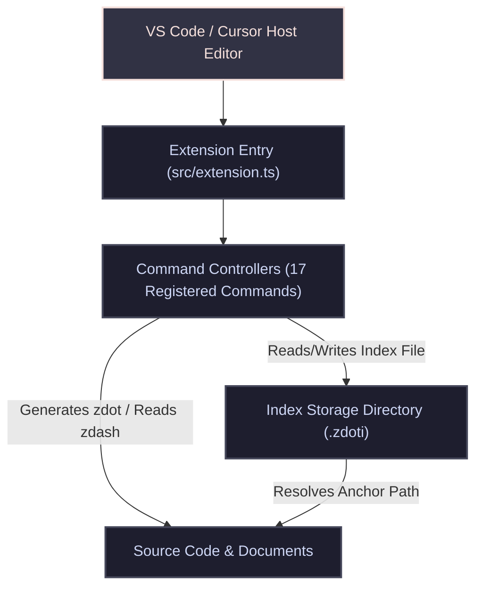

<!-- TEMPLATE: MANUAL.template.md -->
<!--
MANUAL
Any text bounded by double curly braces {{like this}} is a placeholder for you to fill out.
Replace those placeholders with real paths, rules, and project constraints.

INSTRUCTIONS FOR THE AI AGENT:
This file is the developer's handbook. It maps structural topologies, data flow,
core algorithms, algebraic formulas, configuration guidelines, and technical specifications.
-->

<!-- markdownlint-disable MD013 -->

# MANUAL

## 📑 AI Primary Files

- 🔹 [AGENTS.md](../AGENTS.md)
- 🔹 [ARCHIVE.md](ARCHIVE.md)
- 🔹 [BUILD.md](BUILD.md)
- 🔹 [CODE.md](CODE.md)
- 🔹 [DESIGN.md](DESIGN.md)
- 🔹 [FEATURES.md](FEATURES.md)
- 🔹 [LOG.md](LOG.md)
- 🔸 [MANUAL.md](MANUAL.md)
- 🔹 [README.md](../README.md)
- 🔹 [SPEC.md](SPEC.md)
- 🔹 [TASKS.md](TASKS.md)
- 🔹 [TERMS.md](TERMS.md)
- 🔹 [TESTING.md](TESTING.md)
- 🔹 [VERSIONS.md](VERSIONS.md)

---

<!-- TOC location -->
## 🔍 Table of Contents
- [MANUAL](#manual)
  - [📥 Installation & Initial Deployment](#-installation--initial-deployment)
  - [🏗️ 1. Architecture Overview](#️-1-architecture-overview)
  - [🧠 2. Core Modules & Systems](#-2-core-modules--systems)
  - [🔎 3. Core Algorithm & Mathematical Formulas](#-3-core-algorithm--mathematical-formulas)
  - [🛰️ 4. Commands, Keybindings & Context Flags](#️-4-commands-keybindings--context-flags)
  - [🔧 5. Workspace Build & Configuration](#-5-workspace-build--configuration)
  - [🔍 Diagnostics & Common Troubleshooting](#-diagnostics--common-troubleshooting)

---

## 📥 Installation & Initial Deployment

### Setup Sequence

1. **Compile/Build Assets**: Execute `npm run compile` to invoke `build.js` via Bun and assemble `dist/extension.cjs`.
2. **Package Extension**: Execute `npm run package` or `npm run compile:vsix` to generate the `.vsix` extension package.
3. **Register Components**: Install into local VS Code / Cursor via `npm run install-vsix` or `code --install-extension <package>.vsix`.

---

## 🏗️ 1. Architecture Overview

### High-Level Data Flow
1. **Insert Zdot**: User triggers insert command -> 18-digit timestamp ID is generated -> Text inserted into active editor -> `.zdoti` index file written to `zdotdir/YYYY/MM/DD/HHMMSSRRRR.zdoti`.
2. **Jump to Zdot**: User selects a `zdash` (`z-18digits`) -> Extension locates `.zdoti` -> Reads target file path on line 1 -> Opens target file and highlights matching `z.18digits`.

---

## 🧠 2. Core Modules & Systems

- **`resolveZdotDir()`**: Determines storage directory. Priority:
  1. `zdotter.zdotdir` configuration setting.
  2. Workspace root `.zdotter` folder (`<workspace>/.zdotter`).
  3. Home directory `.zdotter` folder (`~/.zdotter`).
- **`getZdotiPath(zdotValue, zdotDir)`**: Computes date-sharded index file path: `[zdotDir]/[YYYY]/[MM]/[DD]/[HHMMSSRRRR].zdoti`.
- **`writeZdoti(zdotValue, targetFile)`**: Writes or updates the `.zdoti` file with target file absolute path on line 1.
- **`insertZdotHandler(outputTemplate)`**: Handles single and multi-cursor zdot creation and insertion.
- **`gotoZdotHandler(focusExisting)`**: Scans current line for `zdash` (`z-<digits>`), resolves source file via `.zdoti`, opens file and positions cursor on `z.<digits>`.

---

## 🔎 3. Core Algorithm & Mathematical Formulas

- **18-Digit Zdot Identifier Generation Formula**:
  $$ \text{ZdotID} = \text{YYYY} \mathbin{\Vert} \text{MM} \mathbin{\Vert} \text{DD} \mathbin{\Vert} \text{HH} \mathbin{\Vert} \text{MM} \mathbin{\Vert} \text{SS} \mathbin{\Vert} \text{RRRR} $$
  - $\text{YYYY}$: 4-digit year (e.g. `2026`)
  - $\text{MM}$: 2-digit month (`01`-`12`)
  - $\text{DD}$: 2-digit day (`01`-`31`)
  - $\text{HH}$: 2-digit hour (`00`-`23`)
  - $\text{MM}$: 2-digit minute (`00`-`59`)
  - $\text{SS}$: 2-digit second (`00`-`59`)
  - $\text{RRRR}$: 4-digit padded random suffix (`0000`-`9999`)

---

## 🛰️ 4. Commands, Keybindings & Context Flags

- **`zdotter.insertZdot`**: Insert default zdot (`z.<id>`).
- **`zdotter.insertTemplate1` - `4`**: Insert zdot formatted with user templates 1-4.
- **`zdotter.gotoZdot`**: Jump to zdot source from zdash link.
- **`zdotter.gotoZdotExisting`**: Jump to zdot source, focusing existing editor group.
- **`zdotter.copyAsZdash`**: Copy zdot under cursor as zdash (`z-<id>`).
- **`zdotter.updateFile`**: Scan document and generate missing `.zdoti` index files for all `z.<id>` occurrences.
- **`zdotter.nextZdot` / `prevZdot`**: Cycle cursor through zdots.
- **`zdotter.nextZdash` / `prevZdash`**: Cycle cursor through zdashes.

---

## 🔧 5. Workspace Build & Configuration

- **`zdotter.zdotdir`**: String setting. Custom root folder path for `.zdoti` index files.
- **`zdotter.outputTemplate1-4`**: String templates. Defaults: `"z.${z}"`, `"[${z}]"`, `""`, `"[${z}]"`.
- **`zdotter.freezeCursorOnInsert`**: Boolean setting. Keeps cursor stationary during insertion when true.

---

## 🔍 Diagnostics & Common Troubleshooting

#### 🚨 Symptom: "No zdash found on current line"
- **Root Cause**: Cursor is not placed on a line containing `z-<18digits>`.
- **Remediation**: Ensure cursor is positioned on or next to a valid `z-` reference.

#### 🚨 Symptom: "Zdoti file not found"
- **Root Cause**: The `.zdoti` index file was moved or deleted, or `zdotdir` path is mismatched across workspaces.
- **Remediation**: Run `zdotter.updateFile` inside the source file to recreate all `.zdoti` index files.

---

## 🚀 Go to...

- 🔹 [AGENTS.md](../AGENTS.md)
- 🔹 [ARCHIVE.md](ARCHIVE.md)
- 🔹 [BUILD.md](BUILD.md)
- 🔹 [CODE.md](CODE.md)
- 🔹 [DESIGN.md](DESIGN.md)
- 🔹 [FEATURES.md](FEATURES.md)
- 🔹 [LOG.md](LOG.md)
- 🔸 [MANUAL.md](MANUAL.md)
- 🔹 [README.md](../README.md)
- 🔹 [SPEC.md](SPEC.md)
- 🔹 [TASKS.md](TASKS.md)
- 🔹 [TERMS.md](TERMS.md)
- 🔹 [TESTING.md](TESTING.md)
- 🔹 [VERSIONS.md](VERSIONS.md)

<!-- TEMPLATE: MANUAL.template.md -->
